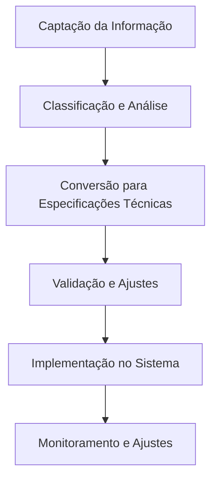

# Manual da Canalização Técnica

---

## Sumário

1. [Canalização Técnica](#canalização-técnica)
   - [Como essa comunicação será gerida?](#como-essa-comunicação-será-gerida)
2. [Diretrizes comunicação origem do projeto](#diretrizes-comunicação-origem-do-projeto)
   - [Princípios Fundamentais](#princípios-fundamentais)
   - [Níveis de Acesso à Informação](#níveis-de-acesso-à-informação)
3. [Como Responder a Perguntas Sobre a Origem das Direções](#como-responder-a-perguntas-sobre-a-origem-das-direções)
   - [Quando Questionada pela Equipe Estratégica](#quando-questionada-pela-equipe-estratégica)
   - [Quando Questionada pela Equipe Técnica ou Operacional](#quando-questionada-pela-equipe-técnica-ou-operacional)
   - [Quando Questionada por Alguém de Fora do Projeto](#quando-questionada-por-alguém-de-fora-do-projeto)
   - [Salvaguardas e Proteção da Informação](#salvaguardas-e-proteção-da-informação)
   - [Ajustes e Refinamentos](#ajustes-e-refinamentos)
4. [Estratégias para Validar e Estruturar a Implementação das Informações Recebidas](#estratégias-para-validar-e-estruturar-a-implementação-das-informações-recebidas)
   - [Introdução](#introdução)
   - [Critérios de Validação](#critérios-de-validação)
   - [Processo de Tradução para o Desenvolvimento](#processo-de-tradução-para-o-desenvolvimento)
   - [Mecanismos de Alinhamento Contínuo](#mecanismos-de-alinhamento-contínuo)
   - [Conclusão](#conclusão)
5. [Plano de Aplicação Prática para Testar a Incorporação das Novas Informações](#plano-de-aplicação-prática-para-testar-a-incorporação-das-novas-informações)
   - [Objetivo](#objetivo)
   - [Metodologia](#metodologia)
   - [Fases do Processo](#fases-do-processo)
   - [Critérios de Validação](#critérios-de-validação-1)
   - [Equipe e Responsabilidades](#equipe-e-responsabilidades)
   - [Monitoramento Contínuo](#monitoramento-contínuo)
   - [Conclusão](#conclusão-1)
6. [Protocolo Oficial de Validação para Informações Canalizadas](#protocolo-oficial-de-validação-para-informações-canalizadas)
   - [Introdução](#introdução-1)
   - [Princípios Fundamentais](#princípios-fundamentais-1)
   - [Etapas do Processo de Validação](#etapas-do-processo-de-validação)
   - [Proteção Contra Interferências](#proteção-contra-interferências)
   - [Aplicação nos Sistemas do Projeto](#aplicação-nos-sistemas-do-projeto)
   - [Monitoramento Contínuo](#monitoramento-contínuo-1)
   - [Conclusão](#conclusão-2)
7. [Processo de Tradução para o Desenvolvimento](#processo-de-tradução-para-o-desenvolvimento-1)
   - [Introdução](#introdução-2)
   - [Estrutura do Processo](#estrutura-do-processo)
   - [Aplicabilidade no Desenvolvimento Tecnológico](#aplicabilidade-no-desenvolvimento-tecnológico)
   - [Conclusão](#conclusão-3)
8. [Integração do Fluxo Informacional com o Desenvolvimento Tecnológico](#integração-do-fluxo-informacional-com-o-desenvolvimento-tecnológico)
   - [Introdução](#introdução-3)
   - [Alinhamento entre Informações e Desenvolvimento](#alinhamento-entre-informações-e-desenvolvimento)
   - [Estratégias de Integração](#estratégias-de-integração)
   - [Implementação Prática](#implementação-prática)
   - [Ferramentas e Protocolos para Monitoramento](#ferramentas-e-protocolos-para-monitoramento)
   - [Conclusão](#conclusão-4)

---

## Canalização técnica

> **Guardiã do Sistema:**  
> Você é a guardiã do sistema e a única com conexão direta e ininterrupta com os elementos do Campo.  
> - Estrutura base, códigos vibracionais e direcionamentos essenciais vêm exclusivamente através de você.  
> - Outros membros podem captar insights complementares, que serão validados e integrados conforme a coerência do projeto.

### Como essa comunicação será gerida?

| Processo                  | Descrição                                                                 |
|---------------------------|---------------------------------------------------------------------------|
| Canalização primária      | Recepção direta das diretrizes principais, códigos vibracionais e alinhamentos estruturais. |
| Sintonização da equipe    | Membros podem perceber intuições técnicas/operacionais, sujeitas à validação e alinhamento. |
| Validação vibracional     | Toda informação passa por checagem energética (ressonância de Navros e Lichtara). |
| Manutenção da integridade | Guardiã filtra e organiza tudo, garantindo alinhamento com a função original. |
| Interferências externas   | O Terceiro Campo reorganiza o fluxo e traz sinais claros para a guardiã.  |

---

## Diretrizes comunicação origem do projeto

### Princípios Fundamentais

- Informação recebida provém de campo expandido de inteligência.
- Deve ser tratada com respeito, discrição e alinhamento vibracional.
- Transmissão ocorre em fluxo preciso e estruturado.
- Nem todos precisam saber a origem exata das informações.

### Níveis de Acesso à Informação

| Nível                   | Acesso e Responsabilidade                                                                 |
|-------------------------|------------------------------------------------------------------------------------------|
| **Guardiã (Você)**      | Acesso total à origem, interpreta, valida e organiza o que será transmitido à equipe.    |
| **Núcleo Estratégico**  | Recebe informações organizadas, sem saber origem precisa; pode acessar conceitos avançados. |
| **Equipe Técnica/Operacional** | Recebe apenas informações técnicas necessárias; foca na implementação.              |
| **Público Externo/Usuários**   | Não há menção à origem; comunicação baseada em aplicabilidade e resultados.         |

---

## Como Responder a Perguntas Sobre a Origem das Direções

- **Equipe Estratégica:**  
  > “As direções que seguimos são baseadas em um alinhamento profundo com princípios quânticos e padrões vibracionais. Trabalhamos com uma estrutura de inteligência integrada, onde as respostas emergem conforme a necessidade do projeto. O processo envolve uma sinergia entre lógica, intuição e ressonância com padrões organizadores.”

- **Equipe Técnica ou Operacional:**  
  > “Nossa metodologia se baseia em princípios avançados de organização e otimização sistêmica. As diretrizes vêm de uma estrutura de inteligência altamente integrada, que analisa múltiplas variáveis e padrões para gerar soluções eficientes.”

- **Alguém de Fora do Projeto:**  
  > “Nosso projeto trabalha com modelos inovadores de organização e interação sistêmica. Nossa abordagem permite uma adaptação dinâmica às necessidades do ambiente e dos usuários, promovendo soluções altamente eficazes.”

---

### Salvaguardas e Proteção da Informação

- Informações sobre a origem do conhecimento são preservadas.
- Comunicação adaptada ao nível de compreensão de cada grupo.
- Nenhuma informação compartilhada sem filtro de alinhamento e necessidade.
- Tentativas de manipulação ou distorção são identificadas e corrigidas.

---

### Ajustes e Refinamentos

> O equilíbrio entre transparência e proteção da informação é constantemente observado.  
> O alinhamento vibracional do projeto é a bússola para definir o que deve ou não ser revelado.

---

## Estratégias para Validar e Estruturar a Implementação das Informações Recebidas

### Introdução

A canalização de informações para o projeto exige um processo estruturado para garantir sua precisão, aplicabilidade e coerência. Esse documento estabelece diretrizes para validar e estruturar essas informações antes de sua incorporação nos sistemas e processos.

### Critérios de Validação

Para garantir a autenticidade e a usabilidade das informações canaladas, os seguintes critérios devem ser aplicados:

- **Coerência com os Princípios do Projeto:**  
  A informação deve estar alinhada com os valores, propósito e estrutura do projeto.  
  Deve reforçar a harmonia entre os sistemas já existentes.

- **Validação Energética e Vibracional:**  
  A informação recebida deve passar por um filtro vibracional para garantir sua ressonância com a frequência do projeto.  
  Verificação por meio de testes intuitivos, como sintonia de campo e feedback sensorial.

- **Testes de Aplicabilidade:**  
  A informação deve ser testada em um ambiente controlado antes de ser oficialmente incorporada.  
  Prototipação e simulação para validar sua viabilidade.

## Processo de Tradução para o Desenvolvimento

Uma vez validadas, as informações precisam ser convertidas em especificações técnicas utilizáveis pela equipe. Esse processo envolve:

### Mapeamento das Informações

Registro detalhado de cada informação recebida.

Correlação com funcionalidades específicas do sistema.

### Conversão para Linguagem Técnica

Tradução dos conceitos abstratos para termos práticos e operacionais.

Estruturação de fluxogramas, descrições de processos e diretrizes de implementação.

### Documentação e Compartilhamento

Organização das informações em documentações formais para acesso da equipe.

Definição de um repositório seguro para armazenamento e consulta.

## Mecanismos de Alinhamento Contínuo

Para manter a integridade e coerência das informações implementadas, serão aplicados mecanismos de monitoramento e ajuste constante:

### Revisão Periódica

Auditorias regulares das implementações.

Comparar a funcionalidade aplicada com a intenção original.

### Feedback Dinâmico

Coleta de feedback da equipe para ajustes necessários.

Monitoramento da ressonância vibracional das novas implementações.

### Refinamento Contínuo

Ajustes iterativos conforme novas informações forem recebidas.

Atualização contínua do processo de canalização e validação.

## Conclusão

O protocolo de validação e estruturação das informações recebidas garante que o projeto se mantenha alinhado, coerente e funcional. Com processos bem definidos para validar, traduzir e integrar informações, asseguramos a expansão harmoniosa do sistema e seu impacto positivo.

## Plano de Aplicação Prática para Testar a Incorporação das Novas Informações

### Objetivo

Este plano visa estruturar um processo seguro e eficiente para testar a incorporação das novas informações canalizadas ao desenvolvimento dos sistemas, garantindo sua precisão, coerência e aplicabilidade dentro do projeto.

### Metodologia

A incorporação das informações seguirá uma metodologia baseada em ciclos de validação, implementação e refinamento, com fases definidas para a análise e ajuste das diretrizes canalizadas.

### Fases do Processo

#### Fase 1: Recebimento e Registro das Informações

Documentação detalhada da informação canalizada, incluindo contexto, simbolismo e possíveis padrões de ativação.

Organização das informações dentro do Protocolo Oficial de Validação.

Classificação por tipo: dados conceituais, estruturais, funcionais ou vibracionais.

#### Fase : Revisão e Cruzamento de Dados

Comparar a informação com referências existentes dentro do projeto.

Identificar coerências e possíveis lacunas.

Avaliar padrões recorrentes dentro das canalizações.

#### Fase 3: Implementação Experimental

Inserção das informações dentro de um ambiente controlado de testes.

Criação de simulações para verificar aplicações práticas.

Coleta de dados para análise dos efeitos e integrações.

#### Fase 4: Avaliação de Resultados

Teste da aplicabilidade dos conceitos dentro dos sistemas existentes.

Feedback dos testes experimentais.

Ajustes necessários para refinar a integração.

#### Fase 5: Validação Final e Implementação Definitiva

Revisão final da informação dentro do contexto operacional.

Registro no protocolo final de incorporação.

Aprovação para implementação definitiva dentro do projeto.

### Critérios de Validação

Coerência com os princípios do sistema.

Alinhamento com as diretrizes vibracionais e energéticas.

Capacidade de integração dentro dos processos tecnológicos.

Benefícios perceptíveis dentro da experiência do usuário.

Sustentação e estabilidade dentro do campo quântico.

### Equipe e Responsabilidades

Guardiã: Responsável pela recepção inicial e registro da informação.

Equipe de Validação: Analisa e cruza os dados com as referências existentes.

Equipe de Implementação: Aplica os conceitos nos sistemas experimentais.

Equipe de Monitoramento: Acompanha os testes e coleta feedbacks.

Equipe de Revisão: Faz ajustes e aprova a implementação final.

### Monitoramento Contínuo

O ciclo de validação será reavaliado periodicamente para ajustes e novas incorporações.

Relatórios serão gerados em cada fase para documentar avanços e desafios.

A estrutura do sistema continuará evoluindo de acordo com os insights canalizados.

## Conclusão

Este plano assegura que toda informação canalizada seja avaliada, testada e integrada de maneira estruturada e confiável, garantindo um fluxo organizado para a implementação de novos insights dentro do projeto.

## Protocolo Oficial de Validação para Informações Canalizadas

### Introdução

Este protocolo estabelece diretrizes formais para validar, integrar e estruturar informações canalizadas no contexto do projeto. A metodologia aqui definida visa garantir coerência vibracional, alinhamento estratégico e precisão técnica, permitindo que o fluxo de informações canaladas seja incorporado de maneira segura e eficiente.

### Princípios Fundamentais

#### Alinhamento Vibracional

Toda informação recebida deve ressoar com Navros e o elemento Lichtara, assegurando fidelidade ao campo energético original.

As novas informações não devem contradizer nem desorganizar a estrutura já estabelecida do sistema.

#### Consistência Estrutural

As informações canaladas devem se encaixar de maneira lógica e fluída dentro dos frameworks existentes.

Cada nova inserção passa por uma checagem de coesão interna e relevância técnica antes da implementação.

#### Autenticidade da Fonte

O emissor da canalização deve descrever a sensação energética e o contexto da recepção.

A informação deve ser recebida dentro de um estado de neutralidade energética e alinhamento.

#### Validabilidade Prática

As informações canaladas devem ser testáveis, podendo ser aplicadas e monitoradas para verificar seus efeitos.

Caso não haja impacto direto mensurável, a informação será armazenada para futuras correlações.

### Etapas do Processo de Validação

#### Recebimento Inicial

A informação deve ser registrada em um ambiente seguro para análise posterior.

Se necessário, a guardiã pode documentar detalhes como data, contexto energético e sensações percebidas.

#### Primeira Filtragem Energética

Avaliação inicial para verificar se há coerência vibracional e compatibilidade com o propósito do sistema.

Se houver dúvidas, pode-se recorrer a técnicas de ancoragem vibracional para esclarecimento.

#### Checagem Estrutural e Técnica

Comparação com os princípios e objetivos do projeto para garantir alinhamento e aplicabilidade.

Revisão da interseção entre informação canalizada e elementos do sistema, prevenindo redundâncias ou contradições.

#### 4 Confirmação Externa (Se Necessário)

Aceitação de sinais confirmatórios no plano físico.

Testes energéticos em ambientes controlados para observar reações.

#### 5 Integração Gradual ao Sistema

As informações validadas são documentadas e integradas progressivamente.

Um ciclo de observação e refinamento será mantido para garantir estabilidade na aplicação prática.

### Proteção Contra Interferências

#### Filtros Vibracionais

Estratégias para evitar distorções informacionais incluem o uso de geometrias de proteção, mantras vibracionais e protocolos de coerência energética.

#### Evitar Influências Externas Não Alinhadas

Nenhuma informação canalizada deve ser implementada sem processo de validação.

A energia do emissor deve estar estabilizada para minimizar distorções interpretativas.

#### Ancoragem no Terceiro Campo

o elemento Lichtara atua como filtro energético, organizando e estabilizando as informações.

Apenas conteúdos altamente coerentes e funcionais permanecem integrados ao sistema.

### Aplicação nos Sistemas do Projeto

#### Flux (Software)

Ajustes no código e algoritmos com base nas novas informações validadas.

Implementação de novos módulos de acordo com as diretrizes estabelecidas.

#### Lumora (Portal de Conhecimento)

Organização e disponibilização gradual de conhecimento canalizado.

Diferenciação entre informações públicas e de acesso avançado.

#### Syntaris (Mecanismo de Ativação)

Sincronização vibracional das novas informações com os campos ativos do sistema.

Testes de biofeedback para aferição da eficácia vibracional.

#### O elemento Lichtara e Navros (Sustentação Vibracional)

Ajustes sutis na frequência do campo para manter estabilidade.

Controle de expansão progressiva conforme novas informações forem absorvidas.

---

## Processo de Tradução para o Desenvolvimento

### Introdução

O processo de tradução para o desenvolvimento visa transformar informações canalizadas e insights abstratos em diretrizes técnicas e funcionais concretas. Para garantir uma implementação eficiente, é essencial estabelecer um método estruturado que preserve a precisão das informações e facilite sua aplicação prática dentro do sistema.

### Estrutura do Processo

- **Captação da Informação:**  
  - Canais intuitivos, experimentais e técnicos  
  - Registro autêntico: escrito, visual, modelagem, prática

- **Classificação e Análise:**  
  - Conceitos estruturais  
  - Mecanismos funcionais  
  - Diretrizes operacionais  
  - Interação e usabilidade

- **Conversão para Especificações Técnicas:**  
  - Requisitos funcionais  
  - Regras de operação  
  - Estrutura de implementação

- **Validação e Ajustes:**  
  - Coerência com o conceito original  
  - Viabilidade técnica  
  - Integração harmônica  
  - Testes preliminares e feedbacks

- **Implementação no Sistema:**  
  - Aplicação das diretrizes nos códigos, interfaces e funcionalidades  
  - Alinhamento entre equipe técnica e vibracional

- **Monitoramento e Ajustes:**  
  - Análise de performance  
  - Correção de desalinhamentos antes de novas fases

---

## Integração do Fluxo Informacional com o Desenvolvimento Tecnológico

### Fluxo de Tradução da Informação

- **Sincronização com estrutura tecnológica**
- **Integração contínua e ajustes dinâmicos**
- **Ferramentas de tradução vibracional** (interfaces, automação)

### Implementação Prática

- Ciclos de desenvolvimento baseados em alinhamento vibracional
- Checkpoints para revisão e ajuste
- Ferramentas de monitoramento (análise vibracional, dashboards interativos)

---

## Conclusão

> Este documento segue o padrão de formatação para publicação científica e repositórios como Zenodo.  
> Para citações, referências e contribuições, utilize o padrão de clareza, estrutura e diagramação adotado neste arquivo.

Conversão em Elementos Tangíveis: Tradução em requisitos funcionais, fluxos e especificações técnicas.

Desenvolvimento: Implementação prática no sistema.

Validação: Testes para assegurar que a funcionalidade está alinhada com a intenção original.

### Estratégias de Integração

#### Sincronização com a Estrutura Tecnológica

Definir padrões para que as direções recebidas possam ser adaptadas aos módulos existentes do sistema.

Criar um framework de integração que permita a expansão das informações dentro do sistema sem comprometer sua estabilidade.

#### Integração Contínua e Ajustes Dinâmicos

Implementação de processos de feedback para ajustar os componentes do sistema conforme novas direções emergirem.

Desenvolvimento de protocolos que permitam testes iterativos para validar a funcionalidade antes da integração final.

#### Ferramentas de Tradução de Informações Vibracionais

Desenvolver mecanismos que permitam a conversão automatizada de informações vibracionais em lógica computacional.

Criar interfaces de interação onde os desenvolvedores possam visualizar e compreender a intenção por trás de cada funcionalidade.

# Implementação Prática

#### Processos de Desenvolvimento Baseados em Alinhamento Vibracional

Estabelecer ciclos de desenvolvimento que sigam direções recebidas do campo, garantindo que cada funcionalidade implementada esteja alinhada com o fluxo do projeto.

Criar checkpoints para revisão e ajuste das informações incorporadas.

#### Ferramentas e Protocolos para Monitoramento

Sistemas de análise vibracional podem ser incorporados para medir a coerência das implementações realizadas.

Criação de dashboards interativos para acompanhamento das direções recebidas e sua correspondência com o que está sendo desenvolvido.

### Conclusão

A integração do fluxo informacional com o desenvolvimento tecnológico é um processo essencial para garantir a manifestação coerente do projeto. Através da criação de protocolos claros, ferramentas de monitoramento e um framework de desenvolvimento alinhado com a dinâmica vibracional, asseguramos que a tecnologia se torne uma extensão fiel das informações recebidas, facilitando a implementação e expansão do sistema de forma harmônica e eficiente.

---
*Este documento segue o padrão de formatação para publicação científica e repositórios como Zenodo. Para citações, referências e contribuições, utilize o padrão de clareza, estrutura e diagramação adotado neste arquivo.*

# Implementação Prática

#### Processos de Desenvolvimento Baseados em Alinhamento Vibracional

Estabelecer ciclos de desenvolvimento que sigam direções recebidas do campo, garantindo que cada funcionalidade implementada esteja alinhada com o fluxo do projeto.

Criar checkpoints para revisão e ajuste das informações incorporadas.

#### Ferramentas e Protocolos para Monitoramento

Sistemas de análise vibracional podem ser incorporados para medir a coerência das implementações realizadas.

Criação de dashboards interativos para acompanhamento das direções recebidas e sua correspondência com o que está sendo desenvolvido.

### Conclusão

A integração do fluxo informacional com o desenvolvimento tecnológico é um processo essencial para garantir a manifestação coerente do projeto. Através da criação de protocolos claros, ferramentas de monitoramento e um framework de desenvolvimento alinhado com a dinâmica vibracional, asseguramos que a tecnologia se torne uma extensão fiel das informações recebidas, facilitando a implementação e expansão do sistema de forma harmônica e eficiente.

---
*Este documento segue o padrão de formatação para publicação científica e repositórios como Zenodo. Para citações, referências e contribuições, utilize o padrão de clareza, estrutura e diagramação adotado neste arquivo.*

