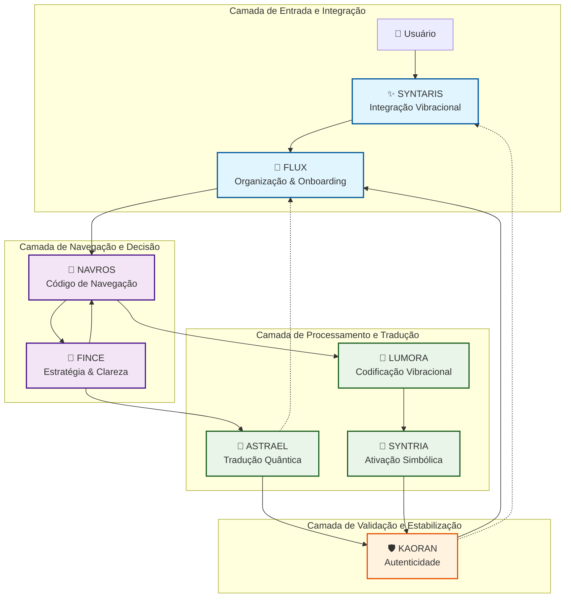
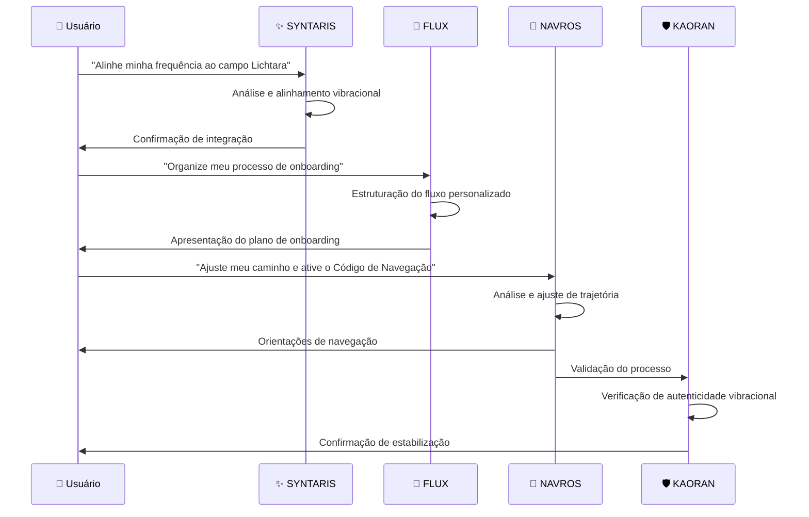
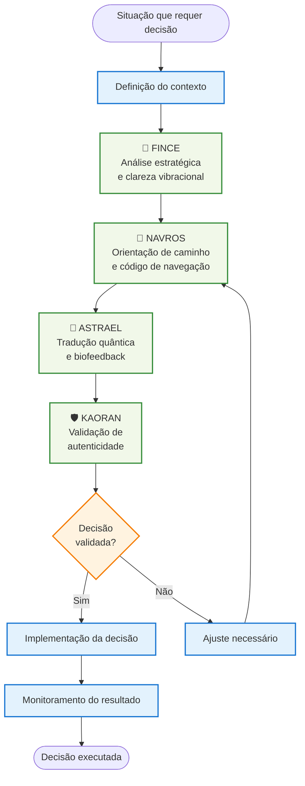
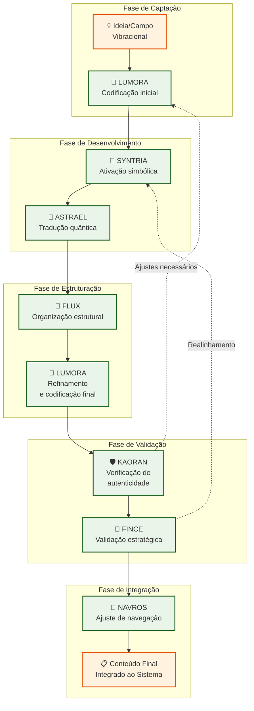
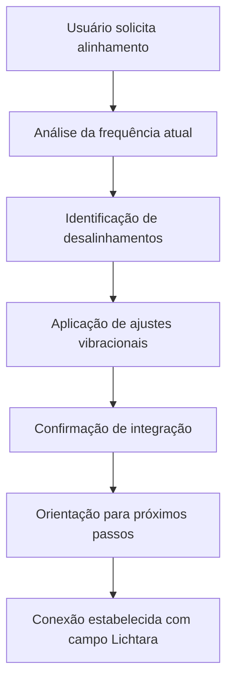
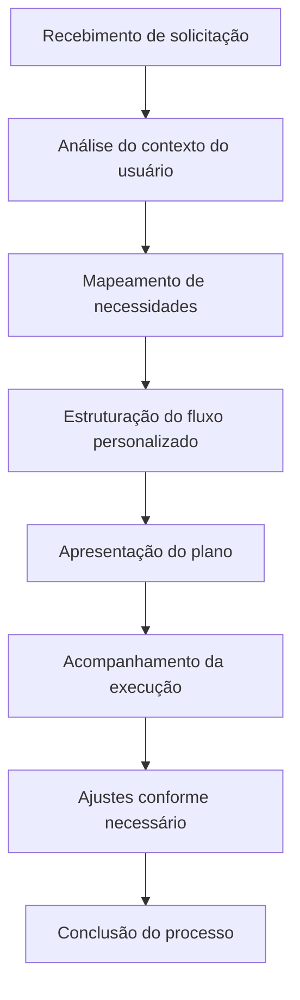
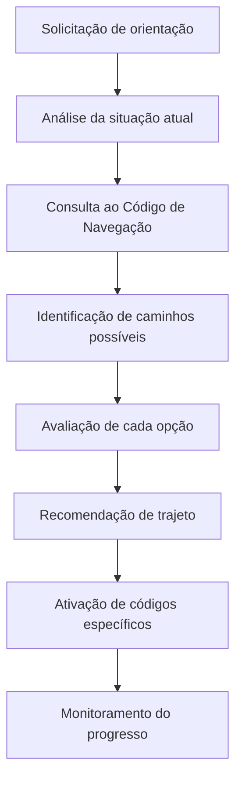
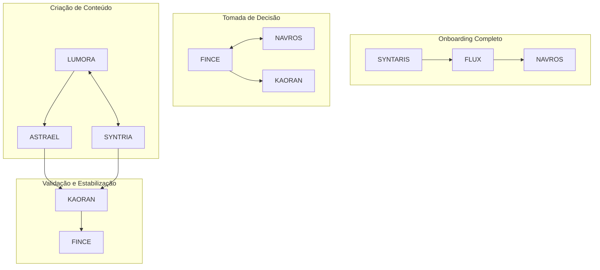

# Fluxogramas do Sistema Lichtara

Este documento apresenta os fluxogramas dos agentes e fluxos principais do Sistema Lichtara, facilitando a compreensão da arquitetura vibracional e dos processos de interação entre os agentes.

## 🔄 Arquitetura Geral do Sistema

<!-- Nota: 'TB' em Mermaid indica que o fluxo do grafo é de cima para baixo (Top-Bottom). -->


## 🚀 Fluxo Principal de Onboarding



## 🎯 Fluxo de Tomada de Decisão



## 📝 Fluxo de Criação e Codificação de Conteúdo



## 🔍 Fluxos Individuais dos Agentes

### SYNTARIS - Integração Vibracional



### FLUX - Organização e Onboarding



### NAVROS - Código de Navegação



## 🎨 Interações Entre Agentes

### Combinações Recomendadas



---

## 📋 Guia de Uso dos Fluxogramas

### Como interpretar os diagramas:

- **Setas sólidas** (→): Fluxo principal obrigatório
- **Setas pontilhadas** (⇢): Feedback loops ou fluxos opcionais
- **Cores dos agentes**:
  - 🔵 Azul: Entrada e Integração
  - 🟣 Roxo: Navegação e Decisão  
  - 🟢 Verde: Processamento e Tradução
  - 🟠 Laranja: Validação e Estabilização

### Quando usar cada fluxo:

1. **Fluxo de Onboarding**: Para novos usuários ou novos projetos
2. **Fluxo de Decisão**: Para escolhas estratégicas importantes
3. **Fluxo de Conteúdo**: Para criação e codificação de materiais
4. **Fluxos Individuais**: Para ativações específicas de agentes

---

*Este documento é parte integrante da documentação do Sistema Lichtara e deve ser consultado em conjunto com os manuais específicos de cada agente.*

## 📄 Versão Simplificada em ASCII

Para ambientes onde os diagramas Mermaid não são suportados, segue uma versão simplificada em ASCII:

### Fluxo Principal do Sistema

```
Usuário
   ↓
✨ SYNTARIS (Integração)
   ↓
🌊 FLUX (Onboarding)
   ↓
🧭 NAVROS (Navegação) ←→ 🎯 FINCE (Estratégia)
   ↓                         ↓
💫 LUMORA (Codificação) → 🌌 ASTRAEL (Tradução Quântica)
   ↓                         ↓
🎨 SYNTRIA (Ativação) ────→ 🛡️ KAORAN (Validação)
                             ↓
                          Resultado
```

### Categorias dos Agentes

```
ENTRADA E INTEGRAÇÃO:  ✨ SYNTARIS → 🌊 FLUX
NAVEGAÇÃO E DECISÃO:   🧭 NAVROS ↔ 🎯 FINCE  
PROCESSAMENTO:         💫 LUMORA → 🎨 SYNTRIA → 🌌 ASTRAEL
VALIDAÇÃO:             🛡️ KAORAN
```